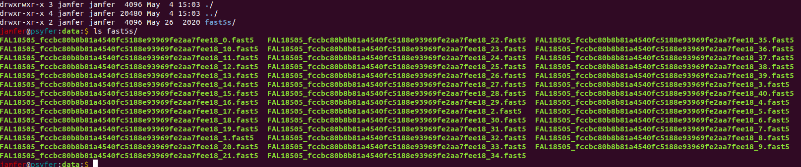
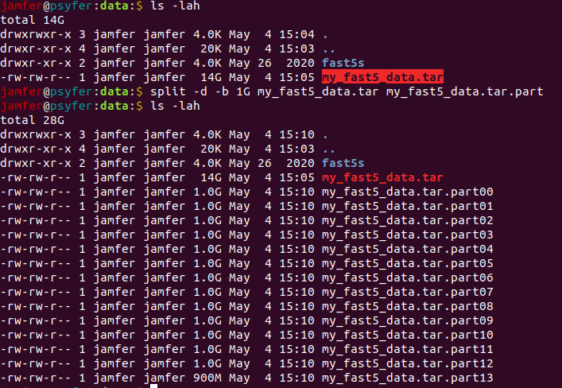

# All things tar related

## Splitting and merging tarballs for partitioned data transfers

When transferring large data sets, especially raw nanopore data such as .fast5 files, many factors can impact the successful receipt of said data sets.

- unstable connections (looking at you Australian internet)
- connection timeouts
- HPC node wall times
- complexity with screen/jobs/interactive sessions
- curl vs wget vs ... for stability, or not able to continue a failed upload/download

to name a few.

Being a kid of the 90s, I grew up download large files (few GB) in hundreds of smaller (1-10mb) files, which were than merged into a single file, ready for extraction. Back then .rar was all the rage for that (but it's windows only), and tarballs can do something similar with the split command.

### Creating a tarball of a fast5 directory

Starting with a directory of fast5 files:

##### We can create the tarball like this:

    tar -cf my_fast5_data.tar fast5s/

##### You can see inside this tarball with

    tar -tf my_fast5_data.tar | head

##### and you can see the size of the tarball in human readable form with

    ls -lah

### Splitting tarball by size

Most often you will want to split a tarball into parts by size. So a 1TB tarball split into parts, 10GB each would yield 100 parts. This might be too combersome for manual download, so if downloading 200-500Gb files is stable, but higher is not (often the case in my experience), then splitting into 2-5 parts is a good balance.

##### split the tarbal like so

    split -d -b 1G my_fast5_data.tar my_fast5_data.tar.part

where:

    -d makes the suffix numerical rather than alpha
    -b sets the size of each part
    my_fast5_data.tar is the tarball to split
    my_fast5_data.tar.part is the prefix to give each part before the number

Now you can transfer each part.

### Merging tarball

##### Once the parts are at their destination, you can reconstruct the original tarball again.

    cat my_fast5_data.tar.part* > my_fast5_data_merged.tar

##### And to check they are indeed the same file, you can run checksum's at either end (the name doesn't change the md5 hash on linux)

    md5sum my_fast5_data_merged.tar my_fast5_data.tar

## Notes:

Cheers to David Eccles (@gringene_bio) on twitter for pointing out:

###### FWIW, tar ("tape archive") does have built-in multi-volume support. It's a bit fiddly to use, though:
https://www.thewebhelp.com/linux/creating-multivolume-tar-files/
